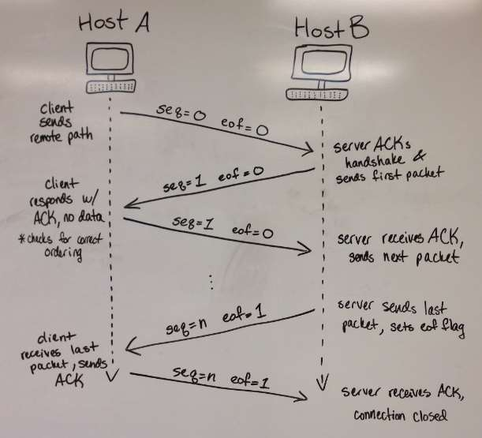
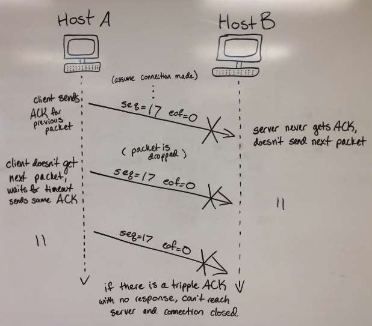
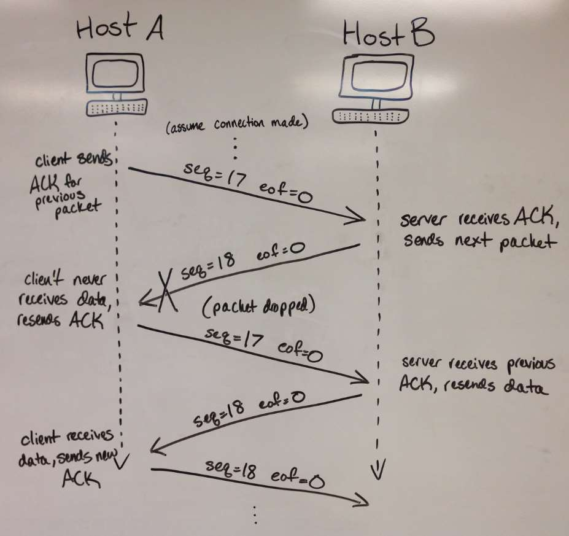

# Reliable File Transfer Over UDP

## Assignment Purpose

The purpose of this assignment was to add reliability services to UDP. That
way, all packets can be transferred from host-to-host in order and without
corruption.

## Build

1. To build the server program, run `gcc -o rft_server server.c socket.* helper.*`,
   or use an IDE like CLion.
2. To build the client program, run `gcc -o rft_client client.c socket.* helper.*`,
   or use an IDE like CLion.

## Specifications

* The goal of this program is for the client to request a file from the server
and then for the server to send the correct file back to the client. The client
begins a handshake with the server by sending a packet with a sequence number
of 0, end of file (eof) flag set to 0, and a body containing the remote path
of the file is requesting. Once the server receives the handshake, it
immediately begins to send data back to the client, increasing the sequence
number by 1. Once the client receives a packet, it checks if the sequence
number is correct: the packet sequence number must be one more than the
client’s record of the previous sequence number. Then the client updates its
sequence number to what was most recently received from the server and sends
an ACK. The client also writes the data received into a local file. Once the
server receives the ACK from the client, it checks that the sequence number is
the same as the packet it previously sent. If that is correct, the server
increments its sequence number and sends the next packet of data. Once the
server reaches the end of the file, it sets the eof flag to 1. If the client
receives this last packet, it reads the eof flag, sends one final ACK, and
disconnects from the server.

* If there is a dropped packet (ACK) on the way to the server, the server will
not send a new packet unless it receives an ACK from the client. The client
will be waiting for the next packet in the sequence but receives none. There
is a timeout for each ACK that is sent, and if the timeout is reached eight
times, the client assumes it cannot connect to the server and disconnects.

* If there is a dropped packet (data) on the way to the client, the client
will resend the same ACK eight times before it decides it cannot reach the
server and disconnects. The server will not send any more data until it
receives the correct ACK.

* If data is received out of order, the client will not accept the packet and
send the ACK of the packet it wants in the correct order. Only when the data
is received at the client in the correct order will its sequence number
increase.

* To use this program, run the server’s executable first. The 1 parameter it
requires is the listening port number. Then run the client’s executable. The
4 parameters it requires is the IP address of the server, the listening port
number, the remote path (the file it is requesting), and the local path (file
the data will be stored into).

```
./rft_server <port>
./rft_client <ip> <port> <remote file> <local file>
```



**Figure 1**: Optimal data transmission, no packet loss



**Figure 2**: Packet loss from client to server



**Figure 3**: Packet loss from server to client

## Credit

- **Assignment Author**: Dr. Dannie Stanley, PhD
- **Assignment Partner**: Grace Rose